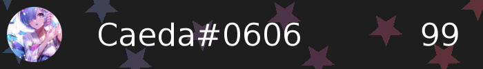

# Discord Level Card

[](https://www.npmjs.com/package/@discord-card/levelcard)
[](https://www.npmjs.com/package/@discord-card/levelcard)
[](https://www.npmjs.com/package/@discord-card/levelcard)
[](https://www.npmjs.com/package/@discord-card/levelcard)

**[](https://discord.gg/Emk2udJ)**

#  Discord Level Card
Simple Levelup cards

## Examples

```javascript
const Discord = require("discord.js");
const { levelupCard } = require('@discord-card/levelcard');
const client = new Discord.Client();

client.on("message", async message => {
    const image = await levelupCard(message.member, {level: 1});

    message.channel.send(new Discord.MessageAttachment(image, 'welcome.png'))
});

client.login('Your-Bot-Token');
```


<br />